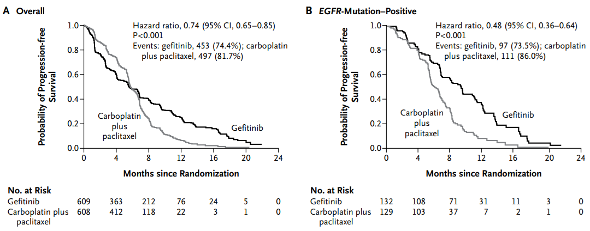

::: {.hero-header}
{.hero-header-img}
:::

# Effects and Time VI − After Cox Regression: A Case Study and R Demonstration

::: {.serif-block .text-right}
Keywords: bias, effect measure, R simulation, survival & competing risks
:::

------------------------------------------------------------------------

### When a hazard ratio has meaning, and when it does not

::::::::::::::::::::::::::::::::: dialogue
::: voice-father
Dad: "Can I have another cup of coffee?"
:::

::: voice-daughter
Me: "Me too."
:::

::: voice-father
Dad: "Let's take this slowly. Proportional hazards is the central feature of Cox regression. When it is plausible, Cox regression is useful across many survival data settings. But in oncology, you sometimes see data where proportional hazards clearly breaks down. Look at this Kaplan-Meier curve from a famous trial comparing gefitinib with chemotherapy (Mok et al. 2009). The curves cross."
:::

::: voice-daughter
Me: "Good. I was starting to fall asleep from all the equations."
:::
:::::::::::::::::::::::::::::::::



::::::::::::::::::::::::::::::::: dialogue
::: voice-father
Dad: "This was a trial among patients with stage IIIB or IV pulmonary adenocarcinoma. In panel A, progression-free survival is lower in the gefitinib group until about six months, then higher afterward. In that situation, proportional hazards does not hold, and a single hazard ratio is hard to interpret."
:::

::: voice-daughter
Me: "Why did the curves cross?"
:::

::: voice-father
Dad: "Gefitinib was especially effective among patients with EGFR-mutant tumors. Panel B shows the subgroup with EGFR mutation. In that subgroup, the curves do not cross; gefitinib is better throughout."
:::

::: voice-daughter
Me: "Even without the equations, I can see that the treatment comparison depends on time."
:::

::: voice-father
Dad: "Exactly. Very few people find hazards intuitive, so don't worry too much. I sometimes think of a hazard as an invisible clock that each patient carries."
:::

::: voice-daughter
Me: "An invisible clock?"
:::

::: voice-father
Dad: "Patients receiving treatment A may carry a clock that runs faster; patients receiving treatment B may carry a clock that runs more slowly. The hazard ratio compares the speed of those clocks."
:::

::: voice-daughter
Me: "That image helps."
:::

::: voice-father
Dad: "But the speed of the clock does not have to stay constant. One treatment can look worse early and better later. When that happens, the interpretation of a single hazard ratio becomes fragile."
:::

::: voice-daughter
Me: "Still, most papers report hazard ratios."
:::

::: voice-father
Dad: "That is why the next step matters. You can also compare risks or survival probabilities at clinically meaningful time points. If the curves cross, decide whether you care about 5-year survival, 10-year mortality, restricted mean survival time, or another time-based summary. Hazard ratios remain useful, but they should not be the only lens."
:::
:::::::::::::::::::::::::::::::::

::: {.callout-note appearance="simple" title="Estimating time-point risk ratios in simulated data"}
Let's look at the invisible-clock idea in simulated data. As before, we simulate survival-time data in which the mortality hazard differs by stoma status, then estimate **risk ratios at specific time points**.

A hazard ratio compares the speed of the invisible clocks. But a risk ratio such as "how many times higher is the 10-year mortality risk in the stoma group?" may be easier to interpret. Cox regression assumes one hazard ratio across time. In contrast, the `polyreg()` function in the **cifmodeling** package can estimate risk ratios either as time-constant summaries or at specific time points.

Using the simulated data, we fit `polyreg()` at 5, 10, and 20 years. The outcome is `Event(time_os,status_os)`, and the exposure is specified as `exposure="stoma"`.
:::

::: {.callout-note appearance="simple" collapse="true" title="Code for generate_data()"}
```{r warning=FALSE}
generate_data <- function(n = 200, hr1, hr2, hr3) {
  stoma <- rbinom(n, size = 1, prob = 0.4)
  sex <- rbinom(n, size = 1, prob = 0.5)
  age <- rnorm(n, mean = 65 + 3 * stoma, sd = 8)
  hazard_relapse   <- 0.10*exp(stoma*log(hr1)+age*log(hr2))
  hazard_death     <- ifelse(stoma == 1, hr3 * 0.10, 0.10)
  hazard_censoring <- 0.05

  t_relapse   <- rexp(n, rate = hazard_relapse)
  t_death     <- rexp(n, rate = hazard_death)
  t_censoring <- rexp(n, rate = hazard_censoring)
  
  time_os   <- pmin(t_death, t_censoring)
  status_os <- as.integer(t_death <= t_censoring)
  
  time_rfs <- pmin(t_relapse, t_death, t_censoring)
  status_rfs <- integer(n)
  status_rfs[time_rfs == t_relapse & time_rfs < t_censoring] <- 1
  status_rfs[time_rfs == t_death & time_rfs < t_censoring] <- 1
  
  time_cir <- pmin(t_relapse, t_death, t_censoring)
  status_cir <- integer(n)
  status_cir[time_cir == t_relapse & time_cir < t_censoring] <- 1
  status_cir[time_cir == t_death & time_cir < t_censoring] <- 2
  
  dat <- data.frame(
    id         = 1:n,
    sex        = factor(sex, levels = c(0, 1), labels = c("WOMAN", "MAN")),
    age        = age,
    stoma      = factor(stoma, levels = c(0, 1),
                        labels = c("WITHOUT STOMA", "WITH STOMA")),
    time_os    = time_os,
    status_os  = status_os,
    time_rfs   = time_rfs,
    status_rfs = status_rfs,
    time_cir   = time_cir,
    status_cir = status_cir
  )
}
```
:::

::: {.callout-note appearance="simple" collapse="true" title="R code and results"}
```{r warning=FALSE}
library(cifmodeling)
set.seed(46)
dat <- generate_data(hr1=2, hr2=1, hr3=1.5)
rr_at_5 <- polyreg(nuisance.model=Event(time_os,status_os)~1, exposure="stoma", data=dat, 
                    effect.measure1="RR", time.point=5, outcome.type="survival")
summary(rr_at_5)
rr_at_10 <- polyreg(nuisance.model=Event(time_os,status_os)~1, exposure="stoma", data=dat, 
                    effect.measure1="RR", time.point=10, outcome.type="survival")
summary(rr_at_10)
rr_at_20 <- polyreg(nuisance.model=Event(time_os,status_os)~1, exposure="stoma", data=dat, 
                    effect.measure1="RR", time.point=20, outcome.type="survival")
summary(rr_at_20)
```
:::

::::::::::::::::::::::::::::::::: dialogue
::: voice-daughter
Me: "Even though the data were generated with a constant hazard ratio, the risk ratios are estimated as 1.367, 1.126, and 1.078. They get smaller over time. The early part of the Kaplan-Meier curve is where the difference is most visible."
:::

::: voice-father
Dad: "Exactly. Effects occur over time. If the size of the effect changes with time, relying only on a hazard ratio can be misleading. You often need to compare risks at meaningful time points."
:::
:::::::::::::::::::::::::::::::::

- **Time-constant effect**: one hazard ratio summarizes the whole follow-up period, as in Cox regression
- **Time-varying effect**: the size of the effect changes over time, visible in survival curves
- **Time-point effect**: risks or survival probabilities are compared at a specified time point, as with `polyreg()`

::::::::::::::::::::::::::::::::: dialogue
::: voice-daughter
Me: "I liked the simplicity of using only the hazard ratio, but I see the problem now. Looking at the survival curve means bringing time back into the causal effect."
:::
:::::::::::::::::::::::::::::::::

### Reference

- Mok TS, Wu YL, Thongprasert S, Yang CH, Chu DT, Saijo N, Sunpaweravong P, Han B, Margono B, Ichinose Y, Nishiwaki Y, Ohe Y, Yang JJ, Chewaskulyong B, Jiang H, Duffield EL, Watkins CL, Armour AA, Fukuoka M. Gefitinib or carboplatin-paclitaxel in pulmonary adenocarcinoma. N Engl J Med 2009;361(10):947-57

### This concludes the Effects and Time series.

Later English releases will continue into regression modeling and causal inference.

::: {.callout-note appearance="simple" collapse="true" title="Other episodes"}

**Episodes in this series**

- [Silent Confusions Hidden in Percentages](effects-1.html)
- [Who Is This Percentage About? Target Populations and Attributable Fractions](effects-2.html)
- [When Odds Ratios Approximate Risk Ratios—and When They Fail](effects-3.html)
- [From Risk and Rate to Survival and Hazard](effects-4.html)
- [A First Note on Cox Regression](effects-5.html)
- [After Cox Regression: A Case Study and R Demonstration](effects-6.html)

**Earlier series**

- [Study Design I](study-design-1.html)
- [Frequentist Thinking I](frequentist-1.html)
- [Frequentist Experiments I](frequentist-4.html)

**Glossary**

- [Statistical Terms in Plain Language](glossary.html)
:::
