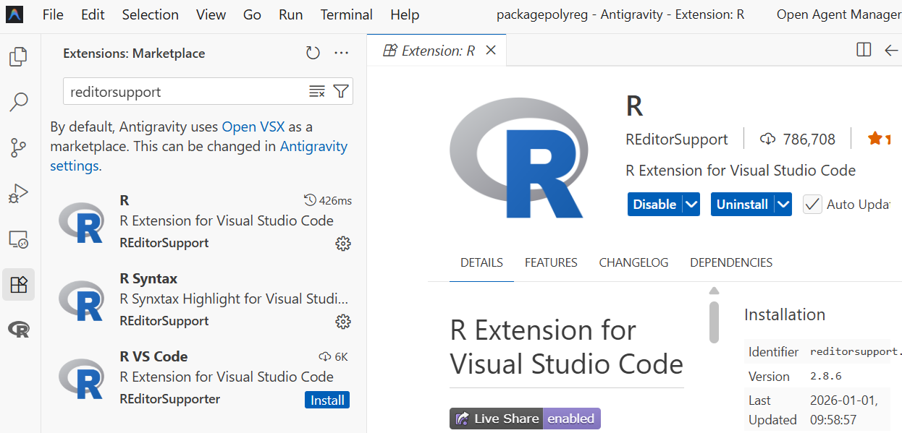
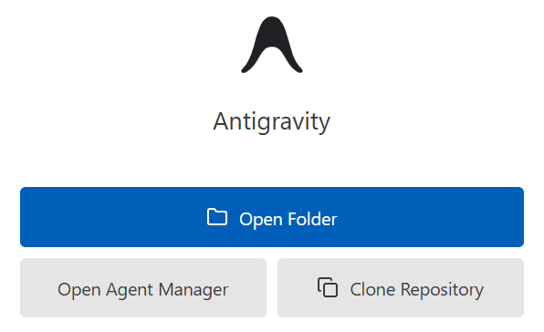
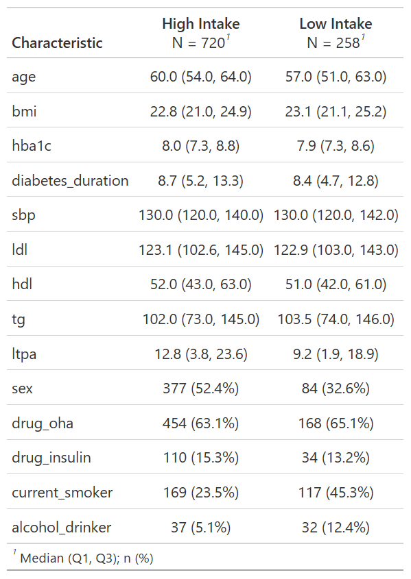

::: {.hero-header}
{.hero-header-img}
:::

# AI & R workflow I − Getting Started: AI-Assisted, Independently Validated Clinical Research Analyses

::: {.serif-block .text-right}
R packages: cifmodeling, dplyr, gtsummary, tableone
:::
------------------------------------------------------------------------

::: {.callout-note appearance="simple" collapse="true" title="シリーズの位置付け"}

このシリーズは、AIを使ってRコードを素早く組み立てつつ、因果推論の実務で求められる品質管理まで含めて完走する、会話形式の短いチュートリアルです。AIは便利ですが、図表が出たとしてもそれが正しいとは限りません。だからこそ、因果推論の実務フローに沿って手順を踏み、検証まで行うことが重要になります。

3つのエピソードで、次のワークフローを一度まわします。

- データ定義 → データ確認 → 仮定の宣言 → 診断 → 推定 → 別実装で検証
- Rパッケージ: gtsummary, cifmodeling, dagitty, WeightIt, cobalt

因果・統計の理屈は本編["A Conversation on Causality at Our Table"](https://gestimation.github.io/coffee-and-research/jp) に譲り、このシリーズではAIとRによる実装と点検に焦点を当てます。
:::

### もちろんAIつかうよね

::::::::::::::::::::::::::::::::: dialogue
::: voice-daughter
私「おはよう、ご飯食べてるところ悪いんだけど、ちょっと聞きたいことがあって。統計解析するときどのアプリを使ってる？あ、コーヒーもらっていい？」
:::

::: voice-father
お父さん「アプリ？...統計ソフトのことだね？コーヒーもどうぞ、まだ冷めてないと思う」
:::

::: voice-daughter
私「そうよ。ソフトなんていわないでよ」
:::

::: voice-father
お父さん「ソフトでしょ」
:::

::: voice-daughter
私「アプリよ。世の中をソフトとハードで分けるよりずっと丁寧な呼び方じゃない？」
:::

::: voice-father
お父さん「よく分かんないけどどっちでもいいよ。よく使うのはSASとSTATAとR。臨床試験ではSAS、メタアナリシスはSTATA、論文によってるような新しい方法はR、って感じ」
:::

::: voice-daughter
私「ふんふん。じゃあやっぱりRにしよう、昔授業で触ったし。いや、解析しないといけないデータがあってさ。食べ終わったらさ、教えてくれない？」
:::

::: voice-father
お父さん「いいけど、パソコンにRStudio入ってたよね？」
:::

::: voice-daughter
私「Antigravityでできるらしいよ。Rも動くって。どっちもこのパソコンに入ってる」
:::

::: voice-father
お父さん「RなのにRStudioを使わないの？なんでAntigravityがいいの？」
:::

::: voice-daughter
私「Googleが出してるからよ。パソコンはGoogleアプリ、タブレットはiOSアプリ」
:::

::: voice-father
お父さん「へえ、まあ、エディターは好みがあるから口出ししないよ。でも使ったことないから設定は教えられないよ」
:::

::: voice-daughter
私「だいじょうぶ。えっとAntigravityを開く。R拡張機能はデフォルトで入ってないから追加する。左サイドバーでRを検索する。あれ、いっぱいヒットした、そりゃそうか。PublisherがREditorSupportのやつをインストールする」
:::



### AIに見せる情報と見せない情報

::: voice-father
お父さん「Antigravityが起動した。インストールできたみたい。なにか操作を求めてるよ」
:::



::: voice-daughter
私「"Open Folder"だな。調査結果を全部まとめたフォルダがあるから、それを開こう」
:::

::: voice-father
お父さん「ん？調査結果ってさ、整理する前だと外部に見せられない情報が入ってたりするじゃない。最低限のデータ以外は、直接AIに見せるのはやめようよ。そうだね、最初にAIエージェントを使って解析するときの約束を4つ決めよう」
:::

::: voice-daughter
私「約束？」
:::

- 整理前のフォルダはAIに見せない。個人が特定できない解析用データセットを用意する。
- 解析用データセットのデータソースやデータ定義の正確性については、自分が責任を持つ。
- 作業記録を残す。たとえば"Clone Repository"を選んでレポジトリで履歴管理する。
- AIが出力したコードは、自主的に品質管理する。たとえば目視チェック、ダブルプログラミング、読み合わせを組み合わせて確認作業を行う。

::: voice-daughter
私「わかった、どれも納得。準備ができてないから今日は練習でいいよね？」
:::
:::::::::::::::::::::::::::::::::

### Table 1をつくるためのRワークフロー

::::::::::::::::::::::::::::::::: dialogue
::: voice-father
お父さん「じゃあ解析を始めよう。AIを使ったことないから**cifmodeling**パッケージに入ってる`diabetes.complications`データでいろいろ試してみたい。このデータは果物摂取量と糖尿病合併症リスクの関係を調べたコホート研究の模擬データだ」
:::
:::::::::::::::::::::::::::::::::

::: {.callout-note appearance="simple" title="データの読み込み"}
```{r}
# install.packages("cifmodeling") #インストールが必要なら実行
library(cifmodeling)
data(diabetes.complications)
dat <- diabetes.complications
```
:::

::::::::::::::::::::::::::::::::: dialogue
::: voice-daughter
私「読み込めたね。よし」
:::
:::::::::::::::::::::::::::::::::

```{r eval=FALSE}
果物摂取量のカテゴリごとに平均年齢を出して
```

::::::::::::::::::::::::::::::::: dialogue
::: voice-father
お父さん「なにしてるの」
:::

::: voice-daughter
私「でたでた」
:::
:::::::::::::::::::::::::::::::::

::: {.callout-note appearance="simple" title="最初の集計"}
```{r}
out1 <- aggregate(age ~ fruitq1, data = dat, FUN = mean)
print(out1)
```
:::

::::::::::::::::::::::::::::::::: dialogue
::: voice-father
お父さん「平均年齢がでた」
:::

::: voice-daughter
私「だいたい58歳くらいね、よし。次はどうすればいい？」
:::

::: voice-father
お父さん「次はどうすればいいって、ちゃんと解析の計画を立ててから動こうよ。そのためにやることはデータセットの確認」
:::

- 変数はなにか（変数名）

- 型はなにか（数値かカテゴリか）

- 欠測はどれくらいか

::: voice-father
お父さん「これは手順の問題で、R自体は難しくない」
:::
:::::::::::::::::::::::::::::::::

::: {.callout-note appearance="simple" collapse="true" title="データセットの一部の出力"}
```{r}
head(dat)
```
:::

::: {.callout-note appearance="simple" collapse="true" title="変数名とデータの型の出力"}
```{r}
sapply(dat, class)
```
:::

::::::::::::::::::::::::::::::::: dialogue
::: voice-daughter
私「ありがとう、曝露変数は果物摂取量を表す`fruitq1`で2値データ、アウトカムは`t`と`epsilon`で生存時間データってことね」
:::

::: voice-father
お父さん「次はどうするかな。そうだな、欠測の数を確かめておこう。`fruitq1`には、扱いやすいように0は”High intake”、1は”Low intake”というラベルをつける」
:::

::: voice-daughter
私「いいね、まかせた」
:::
::::::::::::::::::::::::::::::::: 

::: {.callout-note appearance="simple" collapse="true" title="欠測状況の点検"}
```{r warning=FALSE}
dat$fruit_group <- factor(
    dat$fruitq1,
    levels = c(0, 1),
    labels = c("High intake", "Low intake")
)
exposure_var <- "fruit_group"
outcome_var <- c("t", "epsilon")
continuous_var <- c(
  "age","bmi","hba1c","diabetes_duration",
  "sbp","ldl","hdl","tg","ltpa"
)
binary_var <- c(
  "sex","drug_oha","drug_insulin",
  "current_smoker","alcohol_drinker"
)
dat[binary_var] <- lapply(dat[binary_var], function(x) factor(x, levels = c(0,1)))

colSums(is.na(dat[, c(exposure_var, outcome_var)]))
colSums(is.na(dat[, continuous_var]))
colSums(is.na(dat[, binary_var]))
```
:::

::::::::::::::::::::::::::::::::: dialogue
::: voice-father
お父さん「じゃあ今日の成果物を決めよう。論文でよく使う図表のうち、まずは患者背景を記述するための表はどう？使うパッケージは**gtsummary**がいいと思う」
:::

::: voice-daughter
私「Table 1ね。作りたい。じゃあAIにいうね」
:::
::::::::::::::::::::::::::::::::: 

```{r eval=FALSE}
`tbl_summary()`を使って曝露変数`exposure_var`で層別した集計表を作って
```

::: {.callout-note appearance="simple" collapse="true" title="Table 1の作成"}
::: {.panel-tabset}

## Rコードと結果

```{r, eval=FALSE}
# install.packages("gtsummary") #インストールが必要なら実行
library(gtsummary)
# install.packages("dplyr") #インストールが必要なら実行
library(dplyr)
table1 <- dat[, c(exposure_var, continuous_var, binary_var)] %>%
    tbl_summary(
        by = exposure_var,
        digits = list(
            all_continuous() ~ 1,
            all_categorical() ~ c(0, 1)
        )
    )
print(table1)
```

## gtsummary::tbl_summary

要約統計量を計算し表を作成するgtsummaryパッケージの関数です。表はワードファイル等で出力可能です。

- `by`: 要約統計量を個別計算する変数名

- `digit`: 要約統計量を丸める小数点以下の桁数を指定する数式のリスト

- `statistic`: 表示する要約統計量を指定
  - {n} 頻度
  - {N} 分母
  - {p} 割合（%）
  - {median} 中央値
  - {mean} 平均値
  - {sd} 標準偏差
  - {var} 分散
  - {min} 最小値
  - {max} 最大値
  - {sum} 合計
  - {p##} 任意のパーセンタイル
  - {N_obs} 観測値の総数
  - {N_miss} 欠測の観測値数
  - {N_nonmiss} 非欠測の観測値数
  - {p_miss} 欠測割合
  - {p_nonmiss} 非欠測割合

:::
:::



::::::::::::::::::::::::::::::::: dialogue
::: voice-father
お父さん「いいんじゃない？」
:::

::: voice-daughter
私「表を見たらもう少しこだわりたくなってきた。全体の人数も欲しいし、p値も加えたい」
:::
::::::::::::::::::::::::::::::::: 

```{r eval=FALSE}
平均とSDに変更して。全体集計とp値を表す列を追加して。変数名じゃなくてラベルをつけて。桁数も整えて。
```

::: {.callout-note appearance="simple" collapse="true" title="Table 1を改良したRコード"}
```{r, eval=FALSE}
table1 <- dat[, c(exposure_var, continuous_var, binary_var)] %>%
    tbl_summary(
        by = exposure_var,
        statistic = list(all_continuous() ~ "{mean} ({sd})"),
        digits = list(
            all_continuous() ~ 1,
            all_categorical() ~ c(0, 1)
        ),
        label = list(
            age ~ "Age",
            sex ~ "Women",
            bmi ~ "BMI",
            hba1c ~ "HbA1c",
            diabetes_duration ~ "Diabetes duration",
            drug_oha ~ "Oral Hypoglycemic agents",
            drug_insulin ~ "Insulin use",
            sbp ~ "Systolic blood pressure",
            ldl ~ "LDL cholesterol",
            hdl ~ "HDL cholesterol",
            tg ~ "Triglycerides",
            current_smoker ~ "Current smoker",
            alcohol_drinker ~ "Alcohol drinker",
            ltpa ~ "Leisure-time physical activity"
        )
    ) %>%
    add_p(pvalue_fun = ~ style_pvalue(.x, digits = 3)) %>%
    add_overall()
print(table1)
```
:::

::::::::::::::::::::::::::::::::: dialogue
::: voice-daughter
私「できた！平均・SD・割合の桁数は小数点1桁までだけど、p値は小数点3桁まであった方がいいよね」
:::


::: voice-father
お父さん「ちょっと待ちなよ。このp値はなんのp値？」
:::

::: voice-daughter
私「なにって、曝露と非曝露を比較するp値だよ」
:::

::: voice-father
お父さん「そうじゃなくてさ、なに検定を使ってるの？」
:::

::: voice-daughter
私「あ、たしかに。ちょっと待って調べる。ヘルプは`?add_p()`で出すんだよね。...ふむ、ヘルプをたどるとWilcoxon順位和検定と$\chi^2$検定って書いてあった。期待人数が5より低いと、$\chi^2$検定じゃなくてFisher正確検定が選ばれる」
:::

::: voice-father
お父さん「そうそう。それであってる。ただし、患者背景のバランスをみるときは、p値より標準化平均差（SMD）を使うことが多いけどね。それともうひとつやることがある」
:::
::::::::::::::::::::::::::::::::: 

### 統計解析の品質管理

::::::::::::::::::::::::::::::::: dialogue
::: voice-father
お父さん「これはAIを利用した解析に限らないけど、データの扱いやプログラミングにエラーがないかどうか確認すべきだよね。この手の確認作業は、AIを使った方が効率的だと思う」
:::

```{r eval=FALSE}
この結果が正しいかダブルプログラミングでチェックしたい。別の関数を使って表を作って
```

::: {.callout-note appearance="simple" collapse="true" title="別実装による検証"}
```{r warning=FALSE}
# install.packages("tableone") #インストールが必要なら実行
library(tableone)
# install.packages("dplyr") #インストールが必要なら実行
library(dplyr)

# Prepare data with same labeling
dat_check <- diabetes.complications %>%
    select(all_of(continuous_var), all_of(binary_var), fruitq1) %>%
    mutate(fruitq1 = factor(fruitq1, levels = c(0, 1), labels = c("High intake", "Low intake")))

# Create summary table using tableone
table2 <- CreateTableOne(vars = c(continuous_var, binary_var), strata = "fruitq1", data = dat_check, test = TRUE)
print(table2, showAllLevels = TRUE)
```
:::

::::::::::::::::::::::::::::::::: dialogue
::: voice-daughter
私「p値と桁数とは違うけど、要約指標はあってたみたい。これで問題なさそう？」
:::

::: voice-father
お父さん「患者背景の集計まではね。`CreateTableOne()`でどの検定を使っているか後で確認するとして、いくつか注意点を振り返ってもいい？」
:::

::: voice-daughter
私「どうぞ」
:::

::: voice-father
お父さん「解析はデータからスタートしちゃだめ。必ずプランを立ててから始めること。そしてそうするためには、変数の名前、クラス、データの収集状況を把握する必要がある。これはいいよね」
:::

::: voice-daughter
私「わかってる」
:::

::: voice-father
お父さん「そして、解析結果は最終的に図表にまとめることが多いから、図表のひな型までプランに入れておく。今回は後から全体集計とp値を追加したけど、あんまりスマートじゃなかったよね」
:::

::: voice-daughter
私「まあね。次からはp値がいるかどうか先に考えておく」
:::

::: voice-father
お父さん「うんうん。ここまでをまとめると、どんな解析をするときも最低限この3つは押さえておいた方がいい」
:::

- 変数の定義
- データの収集状況
- 図表のひな型

::: voice-daughter
私「あとさ、お父さんって、AIにプロンプト出すとき関数まで指定するよね」
:::

::: voice-father
お父さん「うん、そうしないと、どの統計手法を使うかがぶれそうだなって、途中で気付いて。それとAIにはダブルプログラミングをさせるべき。こういった工夫は、大きな負担にならない割に、計画通りにプログラミングされているかコントロールしやすくなるよね」
:::
::::::::::::::::::::::::::::::::: 


### 次のエピソードとRスクリプト

臨床研究におけるAIとRの利用に関するふたりの会話はいかがでしたか？以降のエピソードでは、競合リスク解析・交絡調整から頻度論シミュレーション実験までを、Rで体験いただける構成になっています。

- [R Demonstration of Bias in Kaplan-Meier Under Competing Risks](ai-r-2.html)
- [ai-r.R](../from-coffee-chat-to-r/ai-r.R)

### 表の作成スキルに興味がある方へ

"A Conversation on Causality at Our Table"のこのエピソードもご覧ください。

- [Where My Logistic Regression Went Wrong](logistic-regression-4.html)

::: {.callout-note appearance="simple" collapse="true" title="関連エピソードはこちら"}

**このシリーズのエピソード**

- [Getting Started: AI-Assisted, Independently Validated Clinical Research Analyses](ai-r-1.html)
- [R Demonstration of Bias in Kaplan-Meier Under Competing Risks](ai-r-2.html)
- [Unadjusted vs Adjusted Cumulative Incidence Curves with AI & R](ai-r-3.html)

**生存時間解析・競合リスク解析入門（A Conversation on Causality at Our Table）**

- [A First Step into Survival and Competing Risks Analysis with R](study-design-4.html)

**DAG入門（A Conversation on Causality at Our Table）**

- [DAGs and Conditional Distributions: Two Languages for the Same Structure](causal-inference-3.html)

**Rシミュレーション（A Conversation on Causality at Our Table）**

- [Understanding Confidence Intervals via Hypothetical Replications in R](frequentist-4.html)
- [Alpha, Beta, and Power: The Fundamental Probabilities Behind Sample Size](frequentist-5.html)

**用語集**

- [Statistical Terms in Plain Language](glossary.html)
:::
