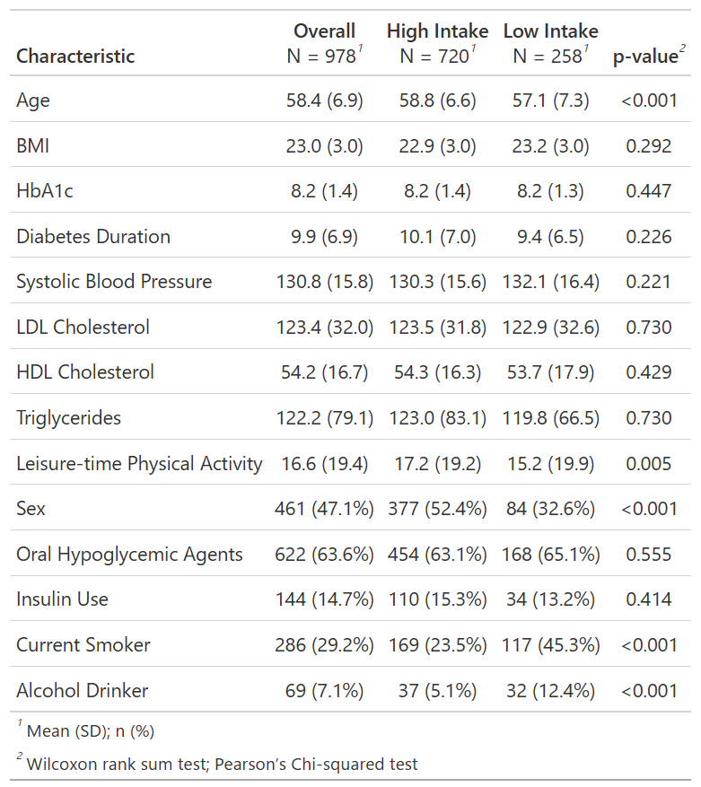

::: {.hero-header}
{.hero-header-img}
:::

# AI & R Workflows III − Unadjusted vs Adjusted Cumulative Incidence Curves with AI & R

::: {.serif-block .text-right}
R packages: cifmodeling, cobalt, dagitty, WeightIt
:::

------------------------------------------------------------------------

::: {.callout-note appearance="simple" collapse="true" title="シリーズの位置付け"}

このシリーズは、AIを使ってRコードを素早く組み立てつつ、因果推論の実務で求められる品質管理まで含めて完走する、会話形式の短いチュートリアルです。AIは便利ですが、図表が出たとしてもそれが正しいとは限りません。だからこそ、因果推論の実務フローに沿って手順を踏み、検証まで行うことが重要になります。

3つのエピソードで、次のワークフローを一度まわします。

- データ定義 → データ確認 → 仮定の宣言 → 診断 → 推定 → 別実装で検証
- Rパッケージ: gtsummary, cifmodeling, dagitty, WeightIt, cobalt

因果・統計の理屈は本編["A Conversation on Causality at Our Table"](https://gestimation.github.io/coffee-and-research/jp) に譲り、このシリーズではAIとRによる実装と点検に焦点を当てます。
:::

### 解析計画は推定目標と仮定からはじまる

::::::::::::::::::::::::::::::::: dialogue
::: voice-daughter
私「シミュレーションはわかったから、実際の累積発生曲線（CIF）の描き方を教えてよ」
:::

::: voice-father
お父さん「いいよ、いいけどさ。やるからには、きちんと段取りを踏もうよ。患者背景が偏ると、CIFの解釈が難しくなることを思い出してほしい。この前`diabetes.complications`でこの表を作ったの、覚えてる？」
:::

::: {.callout-note appearance="simple" collapse="true" title="2型糖尿病患者978人の背景因子の表"}

:::

::: voice-daughter
私「ああ、やったね、これ」
:::

::: voice-father
お父さん「同じデータを使ってCIFを描く。ただし、単なるデータの記述じゃなくて、果物摂取と糖尿病網膜症リスクの関連を調べるための図だ。表を見てよ。果物摂取量でグループを作ったとき（High intake vs Low intake）、年齢、性別、喫煙、アルコール摂取のバランスが崩れているでしょ。この偏りを調整して、果物摂取の因果効果を表すようなCIFのグラフが、今日の成果物。いいかな？」
:::

::: voice-daughter
私「い、いいとも！」
:::

::: voice-father
お父さん「ではまず、`dagitty()`で因果関係を表すグラフ（DAG）を描いておこう。練習だから、このDAGが正しいと仮定して、これに従って解析しよう。調整しなければならない交絡因子も`adjustmentSets()`で出せる」
:::
:::::::::::::::::::::::::::::::::

```{r eval=FALSE}
`dagitty()`でDAGを描いて。曝露変数は`fruitq1`、アウトカムは`t`。
```

```{r eval=FALSE}
共通原因として`age, sex, bmi, hba1c, diabetes_duration, drug_oha, drug_insulin, sbp, ldl, hdl, tg, current_smoker, alcohol_drinker, ltpa`を加えて。次に`adjustmentSets()`を実行して。
```


::: {.callout-note appearance="simple" collapse="true" title="仮定した因果関係を表すDAG"}
::: {.panel-tabset}

## Rコードと結果

```{r warning=FALSE}
# install.packages("dagitty") #インストールが必要なら実行
library(dagitty)
out1 <- dagitty("dag {
age -> fruitq1
age -> t
sex -> fruitq1
sex -> t
bmi -> fruitq1
bmi -> t
hba1c -> fruitq1
hba1c -> t
diabetes_duration -> fruitq1
diabetes_duration -> t
drug_oha -> fruitq1
drug_oha -> t
drug_insulin -> fruitq1
drug_insulin -> t
sbp -> fruitq1
sbp -> t
ldl -> fruitq1
ldl -> t
hdl -> fruitq1
hdl -> t
tg -> fruitq1
tg -> t
current_smoker -> fruitq1
current_smoker -> t
alcohol_drinker -> fruitq1
alcohol_drinker -> t
ltpa -> fruitq1
ltpa -> t
fruitq1 -> t
}")
coordinates(out1) <- list(
  x=c(fruitq1=1, t=7, age=1, sex=2, bmi=3, hba1c=4, diabetes_duration=5, drug_oha=6, 
    drug_insulin=7, sbp=1, ldl=2, hdl=3, tg=4, current_smoker=5, alcohol_drinker=6, ltpa=7), 
  y=c(fruitq1=2, t=2, age=1, sex=1, bmi=1, hba1c=1, diabetes_duration=1, drug_oha=1, 
    drug_insulin=1, sbp=3, ldl=3, hdl=3, tg=3, current_smoker=3, alcohol_drinker=3, ltpa=3)
  )
plot(out1)
out2 <- adjustmentSets(out1, exposure = "fruitq1", outcome = "t")
print(out2)
```

## dagitty::dagitty()

曝露・アウトカム・共変量の因果関係をDAGとして宣言するための関数です。2変数間の関係を`->`で入力します。変数の位置は、dagittyオブジェクトと`coordinates()`に位置情報を与えることで指定できます。

## dagitty::adjustmentSets()

dagittyオブジェクトとして宣言したDAGが正しいと仮定して、バックドアパスを遮断するために必要な変数の集合を返します。

- `exposure`: 曝露変数の変数名
- `outcome`: アウトカムの変数名
:::
:::

### イベント変数と時間変数の記述

::::::::::::::::::::::::::::::::: dialogue
::: voice-father
お父さん「DAGを描いたら、次はイベントの定義を確認しよう。生存時間解析は、ここを間違えると終わりだからね」
:::

::: voice-daughter
私「イベント定義って、`epsilon`のことでいいの？」
:::

::: voice-father
お父さん「そう。`t`が観測された時間、`epsilon`がイベント種別。`epsilon=2`の大血管合併症を競合リスクとして扱う」
:::

- `epsilon=0`: 打ち切り
- `epsilon=1`: 糖尿病網膜症
- `epsilon=2`: 大血管合併症

::: voice-daughter
私「つまりは糖尿病網膜症と大血管合併症の件数と、いつどれくらい起きてるかを確認すればいいんだね」
:::
::::::::::::::::::::::::::::::::: 

```{r eval=FALSE}
**cifmodeling**に含まれている`diabetes.complications`っていうデータセットを読み込んで。`t`と`epsilon`について集計して"
```

::: {.callout-note appearance="simple" collapse="true" title="アウトカムデータの確認"}

競合リスク解析では、**関心イベント（ここでは糖尿病網膜症）**と、**それを観測できなくする競合リスク（ここでは大血管合併症）**があるはずですが、競合リスクがほとんど起きていないこともあり得ます。また、エラーが混入を防ぐためには、生存時間変数（特に最小値の符号と最大値のオーダー）を確認することが有効です。

```{r warning=FALSE}
# install.packages("cifmodeling") # if needed
library(cifmodeling)
data(diabetes.complications)
dat <- diabetes.complications
stopifnot(is.data.frame(dat))
stopifnot(all(c("t","epsilon","fruitq1") %in% names(dat)))

table(dat$epsilon, useNA = "ifany")
summary(dat$t)
tapply(dat$t, dat$epsilon, summary)
```
:::

### プロペンシティスコアに基づく重みの計算

::::::::::::::::::::::::::::::::: dialogue
::: voice-daughter
私「これでアウトカムが集計できたよね。網膜症発症281件、大血管症発症81件。患者背景の要約統計量もTable 1にまとめた。次は偏りを調整するんだっけ。結局なにをすればいいの？回帰？マッチング？」
:::

::: voice-father
お父さん「交絡調整の方法はいろいろあるけど、直接、生存曲線やCIFを扱いやすいのは、**重み付け**と**層別**なんだ。今日は、**covariate balancing propensity score（CBPS法）**を使おう。共変量（covariate）っていうのは、この場合は患者背景因子のことだと思っていい。一般に、プロペンシティスコアを用いた交絡調整では、ふたつの仮定が置かれる。これを頭に置きながら聞いてね」
:::

- プロペンシティスコアの値がグループ間で**オーバーラップ**していること

- **未測定の交絡因子がない**こと

::: voice-father
お父さん「CBPS法は、プロペンシティスコアに基づく重み付けの一種なんだけど、DAGが正しいっていう前提なら、やることは単純。果物摂取（`fruitq1`）の確率を説明できるようなモデルを立てて、そのモデルの下で、共変量のバランスがとれるような重みを求める。共変量のバランスは、比較するグループ間で共変量の平均の差がゼロに近いって言い換えてもいい」
:::

::: voice-daughter
私「えっと、マッチングはしないのね？」
:::

::: voice-father
お父さん「そう、マッチングと重み付けは別。マッチングしたデータセットを作ってから、CIFを描くと、個人間の対応が無視されてしまう。これがはっきり悪いわけじゃないんだけどね。今回は、ひとりひとりに重みを付けたデータセットを作って、重み付きCIFを描く」
:::

::: voice-daughter
私「ふーん。CBPS法とプロペンシティスコアは別なの？」
:::

::: voice-father
お父さん「CBPS法はプロペンシティスコアを使った手法のひとつなんだけど、一番の特徴は、CBPSは一般化モーメント法で計算する。一番オーソドックスなプロペンシティスコアの計算では、ロジスティック回帰を仮定して最尤法で求めることが多い」
:::

::: voice-daughter
私「説明長いな。要するにCBPS法で重みを計算してってAIに言えばいいのか？」
:::

::: voice-father
お父さん「それでいいんだけど、曝露変数や調整したい変数は指定しよう。また、使いたい関数があればそう伝えた方がぶれない。こんな感じで指示を出したらどうかな」
:::
::::::::::::::::::::::::::::::::: 

```{r eval=FALSE}
`weightit()`を使ってCBPSの重みを計算して。変数はさっきの`dagitty()`と同じものを使って
```


::: {.callout-note appearance="simple" collapse="true" title="CBPSの重みの計算"}
::: {.panel-tabset}

## Rコードと結果

```{r warning=FALSE}
continuous_var <- c("age","bmi","hba1c","diabetes_duration","sbp","ldl","hdl","tg","ltpa")
binary_var <- c("sex","drug_oha","drug_insulin","current_smoker","alcohol_drinker")
exposure.model <- as.formula(paste("fruitq1 ~", paste(continuous_var, collapse = " + "), "+", paste(binary_var, collapse = " + ")))

# install.packages("WeightIt") # if needed
library(WeightIt)

out2 <- weightit(exposure.model, data = dat, method = "cbps", estimand="ATE")
dat$ip.weight <- out2$weights
dat$one <- 1
quantile(dat$ip.weight, probs = c(0, .01, .05, .5, .95, .99, 1))
```

## WeightIt::weightit()

交絡調整のための重みを、2値、分類、連続曝露に対して、複数の方法で計算する関数。

- `formula`: 左辺に曝露変数、右辺に調整変数を含むモデル式

- `method`: 重みを計算する方法を指定する。デフォルトの`glm`は一般化線型モデル・最尤法を用いる。`cbps`は一般化モーメント法を用いて共変量バランスを最適化する

- `estimand`: 推定目標を指定する。デフォルトは`ATE`であり、`ATT`、`ATC`、`ATO`、`ATOS`が選択可能
:::
:::

::::::::::::::::::::::::::::::::: dialogue
::: voice-father
お父さん「重み付け解析の弱点のひとつは、重みが極端に大きい値をとると推定が不安定になること。だからAIは、`quantile()`で最大値を出したんだろうね。次に確認するのは、以下のふたつ」
:::
::::::::::::::::::::::::::::::::: 

- オーバーラップの仮定が満たされているかどうか

- 重みを付けた後で共変量バランスがとれているかどうか

::: {.callout-note appearance="simple" collapse="true" title="オーバーラップに基づく重みの診断"}
::: {.panel-tabset}

## オーバーラップ

プロペンシティスコアを用いた交絡調整では、**オーバーラップ**と**未測定の交絡因子はない**という仮定が満たされる必要があります。以下のRコードでは、**cobalt**パッケージの`bal.plot()`を用いて、果物摂取ごと（0は"High intake"、1は"Low intake"）のプロペンシティスコアのグラフを描いています。

```{r warning=FALSE}
# install.packages("cobalt") # if needed
library(cobalt)

out2$covs$ps <- out2$ps
bal.plot(out2, var.name = "ps", which = "adjusted")
```

## cobalt::bal.plot

`ggplot2`を用いて、治療群と共変量間の分布バランスを表示する密度プロット、棒グラフ、または散布図を生成します。

- `var.name`: 表示する変数名。距離変数が明示的に命名されていない限り、引数として`distance`を使用

- `which`: 調整前の共変量バランスを表示するか（`unadjusted`）、調整後を表示するか（`adjusted`）、両方を同時に表示するか（`both`）を選択する。複数の重み付けがある場合、それらの名称も指定可能

:::
:::


::: {.callout-note appearance="simple" collapse="true" title="共変量バランスに基づく重みの診断"}
::: {.panel-tabset}

## 共変量バランス

オーバーラップとは違い、未測定の交絡因子が残っているかどうかは、データから確認することはできません。そこで、DAGで宣言した因果構造が正しいという前提にして、測定された患者背景因子のバランスがとれているかを確認します。プロペンシティスコアを用いた論文の多くで、調整前後の共変量の集計表（`bal.tab()`）と標準平均差のプロット（`love.plot()`）が報告されています。

```{r warning=FALSE}
out3 <- bal.tab(
  exposure.model,
  data    = dat,
  weights = dat$ip.weight,
  un      = TRUE,
  threshold = 0.2
)
out3
love.plot(
  out3,
  stats      = "mean.diffs",
  stars      = "raw", 
  abs        = TRUE,
  thresholds = c(m = 0.1),
  var.order  = "unadjusted"
)
```

## cobalt::bal.tab()

指定した曝露変数について共変量バランスの指標を求めます。これは汎用関数であり、引数のクラスに対応するメソッドが実行されます（たとえば`bal.tab.formula()`）。返り値を`love.plot()`に渡すことで、調整前後の共変量バランスをプロットできます。

- `formula`: 左辺に曝露変数、右辺に調整変数を含むモデル式
- `weights`: 調整に用いる重み
- `un`: 調整前の共変量バランスの指標を表示

:::
:::

::::::::::::::::::::::::::::::::: dialogue
::: voice-daughter
私「ラブプロットで赤い点（調整前）が散らばってたのに、青い点（調整後）が0に寄った。これで交絡調整できたってこと？」
:::

::: voice-father
お父さん「そう、点は共変量ごとのバランス度合いを表している。連続データでは**標準化平均差（standardized mean difference）**、2値データでは**割合の差**だね。もちろん"観測された共変量"以外は、バランスがとれたかどうかは確認できないけど、これはDAGが正しいかどうかっていう別の問題になる。共変量バランスが取れて、オーバーラップも極端に崩れていないなら、CIFを描く段階に進もう」
:::

### 累積発生曲線によるリスクの記述

::::::::::::::::::::::::::::::::: dialogue
::: voice-daughter
私「まあ、模擬データだからCBPSがうまく行って当然だけどね。じゃあ次は普通にCIFを描けばいい？」
:::

::: voice-father
お父さん「うん、最初は重みなしのただのCIFを確認した方がいい。これは因果効果じゃなくて、イベント、打ち切り、競合リスクの発生状況を把握するためのもの。年齢や喫煙による交絡が残っているからね」
:::
::::::::::::::::::::::::::::::::: 

```{r eval=FALSE}
`cifplot()`を使って、累積発生曲線を描いて。`epsilon=1`がイベント、`epsilon=2`が競合リスク。`fruitq1`で層別して"
```

::::::::::::::::::::::::::::::::: dialogue
::: voice-daughter
私「これでいいよね」
:::

::: voice-father
お父さん「いいよ、でも生成されたコードのうち、`code.event1 = 1`と`code.event2 = 2`はこの場合は省略してもいい。時点ごとの追跡状況は、曲線の下にある**アットリスク数（number at risk）**に示されている。打ち切りが起きたタイミングは**ひげ**で表される。別途確認した方がいいけど、登録期間・追跡期間も把握しておいた方がいい。なお、この研究の登録期間は1年間、予定追跡期間は8年間だった」
:::

-   アットリスク数は時点ごとの人数を表す
-   ひげは打ち切りを表す
-   登録期間・追跡期間も要確認

::: voice-father
お父さん「競合リスクの起きたタイミングは、打ち切りと同じように曲線にマーキングするといい。`add.competing.risk.mark=TRUE`を指定する。横軸と縦軸のラベルも変えておこう」
:::
::::::::::::::::::::::::::::::::: 


::: {.callout-note appearance="simple" collapse="true" title="調整前のCIFの生成"}
::: {.panel-tabset}

## デフォルト設定のCIF

```{r warning=FALSE}
cifplot(Event(t,epsilon)~fruitq1, data=dat, outcome.type="competing-risk", code.event1 = 1, code.event2 = 2)
```

## 競合リスクをマーキングしたCIF

```{r warning=FALSE}
cifplot(Event(t,epsilon)~fruitq1, data=dat, outcome.type="competing-risk", 
        add.risktable=TRUE, add.censor.mark=FALSE, add.competing.risk.mark=TRUE,
        label.y="CIF of diabetic retinopathy", label.x="Years from registration",
        label.strata=c("High intake","Low intake"), level.strata=c(0, 1), order.strata=c(1, 0))
```

## cifmodeing::cifplot()

内部で`ggsurvfit()`を用いることで生存曲線やCIFをプロットします。

- `formula`: 左辺に時間変数・イベント変数、右辺に共変量を含むモデル式。時間変数・イベント変数の入力には`Event()`または`Surv()`を用います
- `outcome.type`: Kaplan-Meier法を用いる場合"survival"を指定し、Aalen-Johansen法を用いる場合"competing-risk"を指定します
- `add.risktable`: アットリスク数を表示
- `add.censor.mark`: 打ち切りのマーキングを表示
- `add.competing.risk.mark`: 競合リスクのマーキングを表示

## 競合リスクデータの入力

生存時間・競合リスクデータは2つの変数の組であるため、Rの関数に入力するときもペアで指定する必要があります。**survival**パッケージの`survfit()`や`coxph()`では、実は入力専用の関数`Surv()`を用意しています。入力の仕様はパッケージによってまちまちで、たとえば**mets**パッケージでは`Event()`を別に定義して用いています。**cifmodeling**パッケージの`cifplot()`は、`Surv()`と`Event()`の両方に対応しています。

:::
:::

### 因果効果の推定

::::::::::::::::::::::::::::::::: dialogue
::: voice-daughter
私「次は重み付きで同じ図を出すんだよね。`weights="ip.weight"`って書けばいい？」
:::

::: voice-father
お父さん「それでいいけど、大切なのは図の解釈なんだ。重みを付けた後、アットリスク数はどうなると思う？」
:::

::: voice-daughter
私「重み付きの人数？ん、重みの合計になるのか。そういうこと？」
:::

::: voice-father
お父さん「そう、`cifplot()`のデフォルトでは重みの合計を表示する。言い換えると、重みを付けた結果、もともとの集団から、共変量のバランスがとれた集団に変化するんだ。この集団の意味について説明するね。まず、人数や重みの合計はあまり意味を持たない。だから、**有効サンプルサイズ（effective sample size）**を示す方がいい。これは曲線を推定するために利用できる実質的な情報量を表している。`n.risk.type="ess"`を指定すると、リスクテーブルの数値が有効サンプルサイズになる」
:::

::: voice-daughter
私「分かった」
:::

::: voice-father
お父さん「もうひとつ、この集団の意味について付け加えたい。重み付け後の集団は"High intake"と"Low intake"の2グループが含まれるよね」
:::

::: voice-daughter
私「そうだね」
:::

::: voice-father
お父さん「この2グループは、それぞれ"もともとの集団全体が、high intakeだったときの集団"と"もともとの集団全体がlow intakeだったときの集団"っていうふうに解釈する。もともとの集団ではなく、どちらも仮想的な集団だ。果物摂取量が高いときのアウトカムと、低いときのアウトカムの差が、因果効果なんだ。じゃあ調整CIFを見てみよう」
:::
::::::::::::::::::::::::::::::::: 

::: {.callout-note appearance="simple" collapse="true" title="調整後のCIFの生成"}
```{r warning=FALSE}
cifplot(Event(t,epsilon)~fruitq1, data=dat, outcome.type="competing-risk", 
        weights = "ip.weight", add.censor.mark=FALSE,
        label.y="CIF of diabetic retinopathy", label.x="Years from registration",
        label.strata=c("High intake", "Low intake"), level.strata=c(1, 0), order.strata=c(0, 1), n.risk.type = "ess")
```
:::

::::::::::::::::::::::::::::::::: dialogue
::: voice-daughter
私「調整前より調整後の曲線ではわずかに差が広がったみたい。この曲線の差の分だけ、果物摂取の因果効果があるってことだよね」
:::

::: voice-father
お父さん「そういうこと。次に、有効サンプルサイズを見て。調整前の図のアットリスク数より、有効サンプルサイズは小さいでしょ。重みを付けることで誤差が大きくなったことを示している」
:::

::: voice-daughter
私「ふーん。まあ競合リスク解析の流れは理解できたよ、ありがとう」
:::
::::::::::::::::::::::::::::::::: 

### 統計解析の品質管理
::::::::::::::::::::::::::::::::: dialogue
::: voice-father
お父さん「これで最後の作業だ。CIFのバリデーションをしよう。この場合は、`survfit()`でもCIFの推定値と標準誤差が計算できる。`survfit()`の推定値は`$pstate`っていうオブジェクトに入っている。`cifplot()`の推定値が欲しければ、計算ルーチンの`cifcurve()`を実行して、`1-$surv`を求めればいい。まったく同じ値になるはずだ。標準誤差は`$std.err`っていうオブジェクトなんだけど、別の計算方法を使っているから近い値になるかを見る。まずは調整なしの結果を比較しよう」
:::
::::::::::::::::::::::::::::::::: 

::: {.callout-note appearance="simple" collapse="true" title="別実装による検証（重みなし）"}
```{r warning=FALSE}
# install.packages("survival") # if needed
library(survival)

compare <- function(data, weights, limit.x) {
  out1 <- cifcurve(Event(t, epsilon)~fruitq1, data=data, weights=weights, outcome.type="c", error="if")
  out2 <- survfit(Surv(t, factor(epsilon))~fruitq1, data=data, weights=data[[weights]])
  cbind((1-out1$surv[1:limit.x]),out2$pstate[1:limit.x,2],out1$std.err[1:limit.x],out2$std.err[1:limit.x])
}
compare_unweighted <- compare(data=dat, weights="one", limit.x=20)
print(compare_unweighted)
```
:::

::::::::::::::::::::::::::::::::: dialogue
::: voice-daughter
私「1列目と2列目が`cifcurve()`と`survfit()`の推定値ね。同じ値みたい。でも重要なのは重みを付けてどうなるかだよね」
:::

::: voice-father
お父さん「やってみよう」
:::
::::::::::::::::::::::::::::::::: 

::: {.callout-note appearance="simple" collapse="true" title="別実装による検証（重みあり）"}
```{r warning=FALSE}
compare_weighted <- compare(data=dat, weights="ip.weight", limit.x=20)
print(compare_weighted)
```
:::

::::::::::::::::::::::::::::::::: dialogue
::: voice-daughter
私「こっちもだいじょうぶみたい」
:::

::: voice-father
お父さん「うん、これで図表の完成だね。確かにAIは便利だけど、図表を作った責任は人間にある。作業工程を整理するため、あるいは自主点検のために、チェックリストを作ってみた。簡単なものだけど、作業の説明責任や品質責任のために最低限のポイントは押さえてるんじゃないかな。"品質管理"では、典型的な失敗例を4つ挙げておいた。ひとつでも踏むと、図がそれっぽく出ても計算は間違っている。あらかじめ知っておいた方がいい」
:::
::::::::::::::::::::::::::::::::: 

::: {.callout-note appearance="simple" collapse="true" title="競合リスク解析の実務チェックリスト"}

### 推定目標（estimand）
- 何を比較する？  
  - 例: 果物摂取（High intake vs Low intake）
- どの集団で？（解析対象集団の定義、追跡開始時点、欠測等による除外）
- 何年時点の差を見る？（例：8年CIF差、曲線全体の比較など）
- 競合リスクは何か？（例: 大血管合併症）

---

### 仮定の宣言
- DAG（因果構造の表現）  
  - `dagitty::dagitty()`
- 調整すべき交絡因子の集合
  - `dagitty::adjustmentSets()`
- 未測定交絡に関する考察

---

### データ定義
- イベント変数・曝露変数のコーディング
- コーディングの臨床的意味の確認
- イベント変数と時間変数の集計
  - `table(epsilon)` / `summary(t)` / `tapply(t, epsilon, summary)`

---

### モデル・アルゴリズム
- プロペンシティスコアのモデル  
  - 共変量選択の根拠: DAGや臨床知識
- 重みの計算方法
  - `WeightIt::weightit(..., method="cbps")`
- 論文等で報告すべき情報
  - モデル、重みの計算方法、欠測データの扱い

---

### 診断
- オーバーラップ（positivity）
  - 群間でプロペンシティスコアや重みが偏っていないか
  - 重みが極端でないか
- 共変量バランス
  - `cobalt::bal.tab(...)`
  - `cobalt::love.plot(...)`
  - 標準化平均差（|SMD|<0.1がよく使われる目安）

---

### 推定
- 未調整CIF（記述）
  - `cifmodeling::cifplot(..., weights = NULL)`
- 調整CIF（因果効果） 
  - `cifmodeling::cifplot(..., weights="ip.weight")`
- 標準誤差・信頼区間・アットリスク数は、重み付きに対応しているか
  - `cifmodeling::cifplot(..., n.risk.type = "ess")`
  - `cifmodeling::cifplot(..., error = "if")`

---

### 品質管理
- 別実装による検証
  - `gtsummary::tbl_summary()` / `tableone::CreateTableOne()`
  - `cifmodeling::cifplot()` / `survival::survfit()`
- 目視チェック
  - **競合リスクとして扱われているか**を出力で確認
  - イベント変数・時間変数の集計結果と曲線の比較
- 典型的な失敗例
  - イベント変数が競合リスクを含んでいるはずが無視される（変数の型やNAに注意）
  - イベント変数のコーディングエラー（`survfit()`の`$pstate`は、両方のイベントの結果を含むのでコーディング要確認）
  - 重み変数の指定エラー（調整変数集合が複数あるとき間違えやすい）
  - 重み変数がゼロや極端に大きい値を含んでいる

:::

::: {.callout-note appearance="simple" title="このエピソードに関係するクイズです"}

同じ生存時間データでも、パッケージの仕様・コーディングによってイベントの扱いが変わるため、正しく競合リスクが指定できているか気をつける必要があります。`cifplot()`では、`outcome.type="survival"`または`outcome.type="competing-risk"`で区別します。それでは、`survfit()`でAalen-Johansen曲線を選ぶための指定として正しいのは、次のうちどれでしょうか。もちろん、イベント変数には3水準以上が含まれることが前提です。

1.  イベント変数の水準が0, 1, 2という数値なっていること
2.  イベント変数の数値に2が含まれていること
3.  イベント変数がfactor型であること
4.  `survfit(..., type="mstate")`というオプションを指定すること
:::

::: {.callout-note appearance="simple" collapse="true" title="答えはこちら"}
-   **正解は3です**

`survfit()`の挙動は、イベント変数がnumeric型かfactor型かで異なります。イベント・打ち切りのコーディングによっても結果は変わりますが、numeric型のイベント変数を用いると、"Surv(t, epsilon) で: Invalid status value, converted to NA"という警告メッセージが出て競合リスクは無視されます。

また、`type="mstate"`というオプションは、**survival**パッケージversion 3.8-3では使用されていません。

競合リスクを無視した場合、`survfit()`の出力には生存確率（`surv`）が含まれます
。一方で、競合リスクを含む複数イベントを扱う場合は、生存確率の代わりに推移確率（`pstate`）が出力されます。以下のRスクリプトを実行して、factor型とnumeric型の出力の違いを確認してみてください。

```{r eval=FALSE}
library(survival)
library(cifmodeling)
data(diabetes.complications)
out3 <- survfit(Surv(t, factor(epsilon))~fruitq1, data=diabetes.complications)
names(out3)
out4 <- survfit(Surv(t, epsilon)~fruitq1, data=diabetes.complications)
names(out4)
```
:::

### 因果・統計・研究に興味がわいた方に

ぜひ、"A Conversation on Causality at Our Table"もあわせてお楽しみください。この物語は、研究仮説→統計→因果→言語という順で、ある臨床研究を描いています。迷った方へのおすすめエピソードはこちら。

- [**会話のはじまりと研究仮説（Study Design I）**](study-design-1.html)
- [**95%の誤解を一刀両断（Effects and Time I）**](effects-1.html)
- [**交絡・因果推論の入り口（Adjusting for Bias I）**](logistic-regression-1.html)
- [**よりよい論文を書くための3箇条（Publish a Paper II）**](publish-a-paper-2.html)

どのエピソードも独立しているので、興味の向くレイヤーを選んでも構いません。

::: {.callout-note appearance="simple" collapse="true" title="関連エピソードはこちら"}

**このシリーズのエピソード**

- [Getting Started: AI-Assisted, Independently Validated Clinical Research Analyses](ai-r-1.html)

- [R Demonstration of Bias in Kaplan-Meier Under Competing Risks](ai-r-2.html)

- [Unadjusted vs Adjusted Cumulative Incidence Curves with AI & R](ai-r-3.html)

**生存時間解析・競合リスク解析入門**

- [A First Step into Survival and Competing Risks Analysis with R](study-design-4.html)

**Rシミュレーション**

- [Understanding Confidence Intervals via Hypothetical Replications in R](frequentist-5.html)
- [Alpha, Beta, and Power: The Fundamental Probabilities Behind Sample Size](frequentist-6.html)

**DAG入門**

- [DAGs and Conditional Distributions: Two Languages for the Same Structure](causal-inference-3.html)

**用語集**

- [Statistical Terms in Plain Language](glossary.html)
:::
